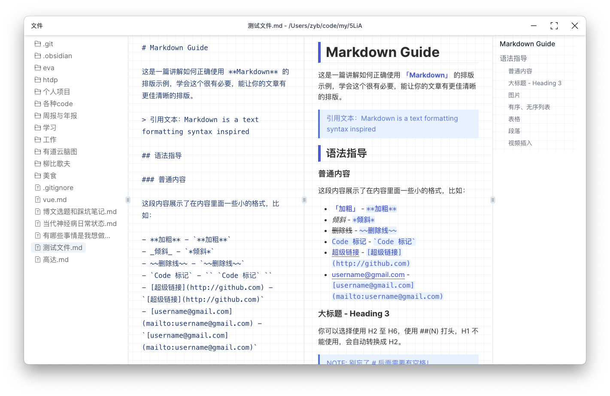

  <!-- <h1>InnoTe</h1> -->
  
  

  <h3>基于 Electron/Next 的 Markdown 管理工具。</h3>

  <figure>
    
    <figcaption>
      <!-- 
自由的 Markdown 管理工具。
 -->
    </figcaption>
  </figure>

 

## 特性

- [x] 从本地目录读取笔记，您的数据完全由您自己管理，**更不需要开通 VIP 来支持导出数据**
- [x] 完全离线，无需担心您的数据上传到云端
- [x] 所见即所得的 Markdown 编辑器
- [ ] ~~编不下去了，摊牌了还没弄完 😭~~
